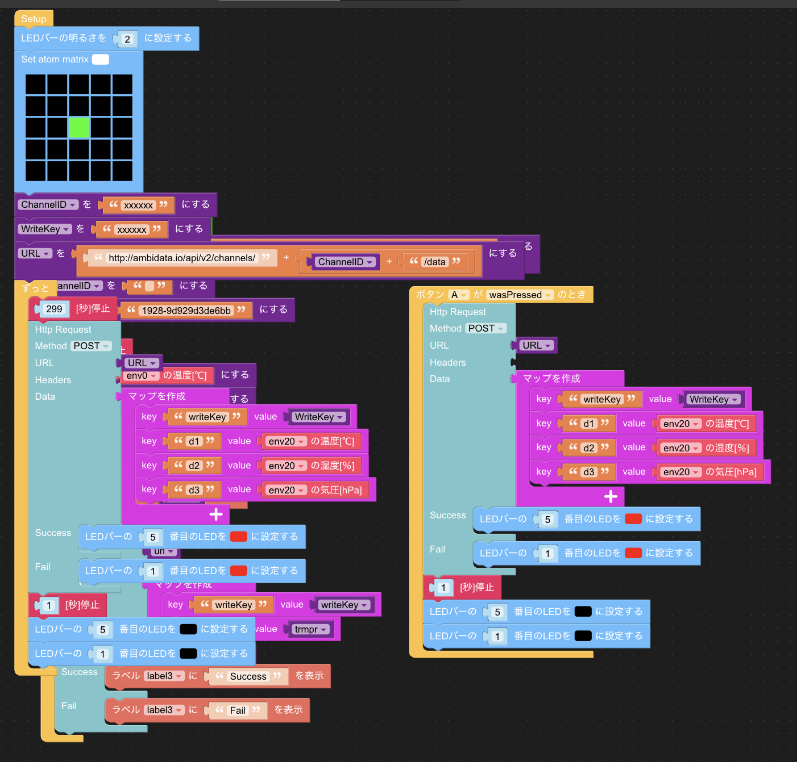
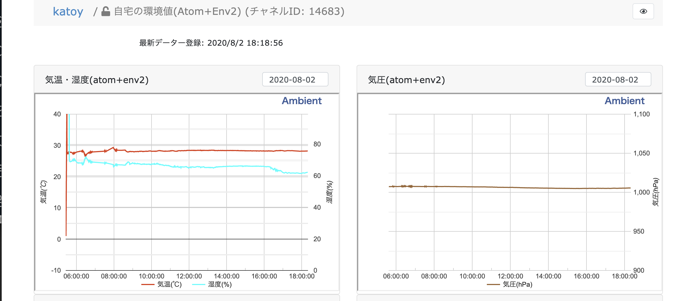

M5Stack で遊ぼう

# ゴール

IoT で社内、自宅を便利にしていく仲間を増やす。

# 参考情報

### M5Staic.com

- 各種の公式センサー https://m5stack.com/collections/m5-unit
github https://github.com/m5stack
- beetleC のサンプルコード  https://github.com/m5stack/M5-ProductExampleCodes/tree/master/Hat/beetleC/stickC/beetleC
- サンプルの操作動画 https://twitter.com/lovyan03/status/1158292113496264704

### スイッチサイエンス

- 部品の調達  https://www.switch-science.com/catalog/list/1/
- 情報動画 【はじめてのM5Stack 】第2回 機能チェックと初期セットアップ https://mag.switch-science.com/2019/10/23/m5go-setup/

### ふるさと納税で micro:bit を入手
http://www.citydo.com/furusato/official/saitama/sayama/items/item150.html

### 注目の書籍
- みんなのM5Stack入門 単行本（ソフトカバー） (2019/11/8) https://www.amazon.co.jp/dp/4865942092/

### その他

- M5StickV を使って1000種類の物体をオフラインで認識して日本語で読み上げするやつできた。  https://twitter.com/ksasao/status/1153663853781061632

- micro:bitでドローンを作ってみよう——クワッドコプター組み立てキット「Air:bit」 https://fabcross.jp/news/2019/20191007_airbit.html

- PLEN:bit は micro:bit を使った小さな二足歩行ロボットキットです https://plen.jp/wp/plenbit/

- 【台風監視】温度, 気圧, 湿度をm5StickCとUIFlowとAmbientで可視化してみました https://yoichi-41.hatenablog.com/entry/2019/10/12Typhoon

- ご家庭のプリンを守るスマート錠「プリン・ロック」を作ってみた　https://www.nicovideo.jp/watch/sm35804879

- 冷蔵庫のプリンを食べる犯人に警告を発して反省までさせるデバイス「プリン・ア・ラート2」  https://news.livedoor.com/article/detail/14591291/

## beetleC の仕組み

- beetleC の公式サンプル:
   beetleC を wifi AcceccPoint にする。 http 通信する。

   htttp://192.168.4.1/ctl  で iphone でアクセスすると
   スライダーを２つ表示するような HTML を返す。
   (プログラムコード的には、 html 内容を zip したバイト列を char のデータ文にしてもっていて、それを出力している)
   スライダーの操作に応じて get でスライダお数値が beetleC に届く)

- ソースコード
https://github.com/m5stack/M5-ProductExampleCodes/tree/master/Hat/beetleC/stickC/beetleC

https://qiita.com/yi_2018/items/822811c0ba29725354ee
では ゲームパッド + http 通信で操作した例が示されている。

https://twitter.com/komde/status/1182261774956953602
では、 html ソースを変更して、画面を変更した例がしめされている

## 私の改善例

（M５Stack ＋ ジョイスティック) でコントロールする。
通信は ESPNow というものを使う.

## 　ジョイスティックの利用例

ジョイスティックの座標  https://omoroya.com/arduino-lesson14/

ジョイスティックで 左右のモーターの回転量を制御する。

- 中央の位置で (0, 0)  # 左の回転 0, 右の回転 0)
- 90 度の無垢で (1, 1) # 左右とも Max 前進回転
- -90 度の位置で (-1,-1) # 左右とも Max 後退)
- 0 度の位置で (1, 0) # 左だけが回転させて、車を右に旋回させる

joystic から出力値 を平行移動してから 反時計周りに 45 度回転させて、なにか係数をかければ、求めるような数値に変換できる、
(線形台数というか、座標の平行変換、回転の知識がないと、プログラミング作成・理解は困難!)

## マシン間の通信

ESP-WROOM-02の直接通信モードESPNOWを試す　https://jiwashin.blogspot.com/2016/03/espnow-direct-communication-mode-of-esp8266.html
> ...
> ESP NOWは生パケットをやりとりするモード。DHCPどころかチャンネル自動選択もないので基本的にはチャンネル指定して送りっぱなし。つまり、余計な処理がない分オーバーヘッドも消費電力が少ないということです。
> ...

{left: 0, right: 0, color: "red"} のような Map を作り、それを json.dump して、送信する、
受信側(beetleC) では json.load して Map にも. loft, right の数値に応じてモーターを回し、 colore で LED を発光させる。

beetleC 側のプログラムでは、 通信を受けたときの動作は callback としてメソッド定義するのだが、
UIFLow でのブロックプログラミングでは、自然に ”データ受信したとき" のブロックをおいて、その中に処理ブロッをおいていくだけ。

https://github.com/katoy/m5stack_sample_sensor/blob/master/beetleC_with_joystick/car.py

# 気温/湿度/気圧の観測

[../atom/env_2_matrix.m5f](../atom/env_2_matrix.m5f) は、
atom_matrix + env2 で測定した気温/湿度/気圧 Ambient でグラフ表示する例です。

5 分毎に測定して Ambient に送信してます。ボタンA (atom_matrix の画面) を押すと、直ちに想定して送信もします。  
Ambientent との通信が成功すれば、右上の LED を光らせます(一秒間)。  
通信が失敗すれば、左上の LED を光らせます(一秒間)。  

参考情報
- [https://ambidata.io/samples/m5stack/uiflow/](https://ambidata.io/samples/m5stack/uiflow/)  
UIFlow（Blockly）でAmbientにデータを送る

- [https://twitter.com/gomihgy/status/1189082065330851840](https://twitter.com/gomihgy/status/1189082065330851840)  
  M5Stack のUIFlowのブロックで、Ambient にデータを送るメモ  

