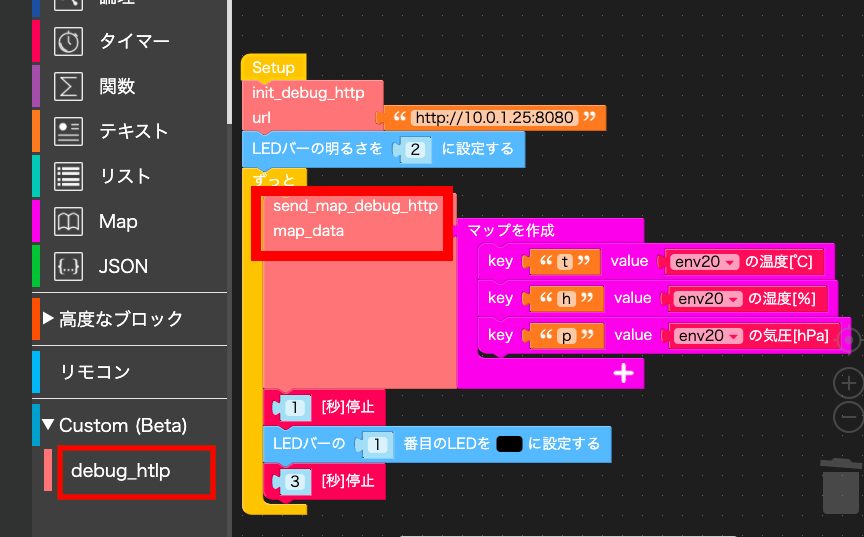
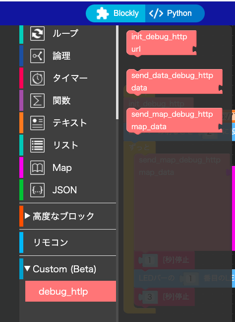
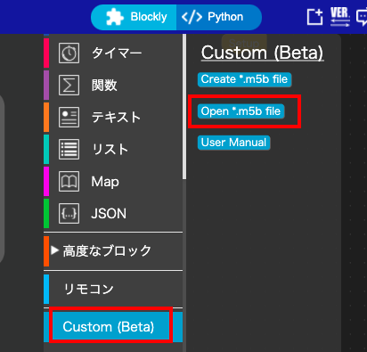
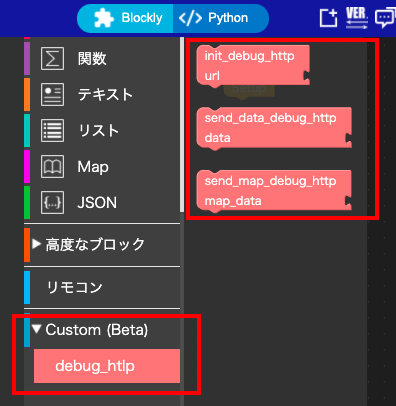
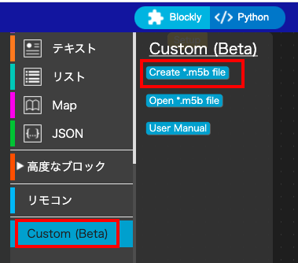
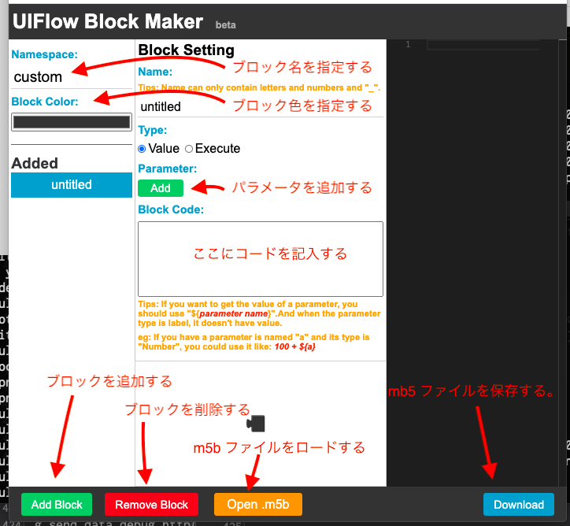
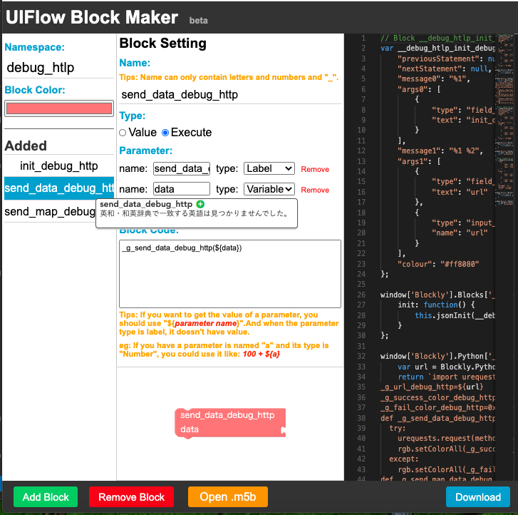
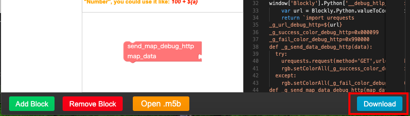

<!-- vscode-markdown-toc -->
* 1. [概要](#)
* 2. [簡易 http サーバー](#http)
* 3. [標準の Http ブロック](#Http)
* 4. [カスタムブロック](#-1)
	* 4.1. [プログラム作成手順](#-1)
	* 4.2. [カスタムブロックの作り方](#-1)

<!-- vscode-markdown-toc-config
	numbering=true
	autoSave=true
	/vscode-markdown-toc-config -->
<!-- /vscode-markdown-toc -->

# atoom lite + Env 2

##  1. <a name=''></a>概要

atom lite に Env 2 unit を接続し、uiflow でその値を取得するプログラムを書いてみました。  
atom lite には LED が１つ付いているだけで、数値などを表示することはできません。  
そこで 数値を http サーバーに値を送るようにします。
http サーバー側のログなので、Env 2 で取得した値を確認しようということです。

http 送信のブロックは標準で用意されていますが、custom block をつくって http 送信をしてみました。




環境：

* Uiflow 1.6.2
* macos catalina
* ruby 2.7 (on mac)
* [atom lite](http://ssci.to/6262)
* [Env 2](http://ssci.to/6344)


##  2. <a name='http'></a>簡易 http サーバー

atom lite からの http 送信先の サーバーを用意します。  

言語はなんでもよいのですが、ここでは ruby で書いてみました。
http GET と POST の要求があったら requer 内容をコンソールに表示するだけのものです。  

[./src/http_server.rb](./src/http_server.rb)

curl で GET と POST を送ってみます。

```bash
$curl http://localhost:8080/name=123?age=10

$curl -X POST -H "Content-Type: application/json" -d '{"Name":"kato", "Age":"100"}' localhost:8080
```


実際には、 [NODE-Red](https://nodered.jp/about/) や, [Ambient](https://ambidata.io/) にデータを送ったりするということになるでしょう。

##  3. <a name='Http'></a>標準の Http ブロック

UiFlow の 高度なブロック の生木 Http のカテゴリーがあります。  


##  4. <a name='-1'></a>カスタムブロック

atim lite の UiFlow でのプログラムで変数の値などをデバッグのために出力させるのに使いやすいようにカスタムブロックをつくってみました。（シリアル出力の代わりに使うことを想定しています)



各ブロックの機能を述べます。

* init_debug_http
http サーバー呼び出しの初期化をします。  
http サーバーの url をテキストで指定します。(例： "http://10.0.1.1:8080)  

* send_data_debug_http
テキストや数値などを Get で http サーバーに送ります。  
送信が成功すれば、LED が青になります。  
失敗すれば、LED が赤になります。  
data に送信したい情報を指定します。
内部で str(data) されて GET で送信されます。

* send_map_debug_http
Map を Post で  http サーバーに送ります。  
送信が成功すれば、LED が青になります。  
失敗すれば、LED が赤になります。  
map_data に Map を指定します。

このカスタムブロックをつかったプログラム例を示します。


###  4.1. <a name='-1'></a>プログラム作成手順

atom lite に Env 2 をケーブルでつなげます。ケーブルで接続しただけでは、 uilow から Env 2 は利用できません。  
Env 2 を uiflow に登録する必要があります。

画面左下の + アイコンをクリックします。


Env 1 アイコンをクリックして チェックマークが付いたのを確認したら、右下にある OK ボタンをクリックします。


Unit カテゴリーに環境ブロックが追加されます。


debug_http ブロックを追加するするには次のようにします。
[debug_http.mb5](dest/debug_http.m5b) を予め PC の任意の場所に download して起きます。
Custom カテゴリーを開き、 open *.m5b file をクリックします。



ファイル指定ダイアログが開かれるので、debug_http.m5b を指定します。
load が終了すれば、Custom カテゴリーに debug_http ブロックが追加されます。


このddbug_http ブロックにあるブロックは、他のブロックと同等に利用できます。

これで、Env 2 からの情報取得と、カスタムブロック debug_http を利用できるようになりました。

init_debug_http で 送信先 http サーバーの URL を設定し、
ループ中で数秒感覚で Env 2 から得た気温、湿度、気圧の値を
Map にして send_map_debug_http で送るようにブロックを組み上げていってプログラムを作成させます。  
(あるいは、 作成済みのプログラムフィアル [dest/main_0.m5f](dest/main_0.m5f) を load してください)

プログラムを実行させれば、http サーバー起動をした PC のコンソールに 4 秒ごとに 気温, 湿度, 気圧が表示されます。  
atom lite の LED は 4 秒音に 青くなりあす。（送信が失敗している場合は LED は赤くなります。)  


###  4.2. <a name='-1'></a>カスタムブロックの作り方

このカスタムブロックの作り方を述べます。  
カスタムブロックの作り方を覚えると、uiflow でのプログラムの幅が広がります。

create *m4b file ボタンをクリックします。


ブロック作成のための Block Maker 画面が開きます。



init_debug_http ブロックを編集します。  
このブロックは Excute タイプと指定します。
パラメータの一番目はブロックの名前を Label として指定します。これはブロックのアイコンにブロック名として表示されます。
２番目のパラメータに variable タイプで url を指定します。  
コード部は以下のものを指定します。

```python
import urequests
_g_url_debug_http=${url}
_g_success_color_debug_http=0x000099
_g_fail_color_debug_http=0x990000
def _g_send_data_debug_http(data):
  try:
    urequests.request(method='GET',url=_g_url_debug_http+"/data="+str(data),headers={})
    rgb.setColorAll(_g_success_color_debug_http)
  except:
    rgb.setColorAll(_g_fail_color_debug_http)
def _g_send_map_data_debug_http(map_data):
  try:
    urequests.request(method='POST',url=_g_url_debug_http,json=map_data,headers={'Content-Type':'application/json;charset=UTF-8'})
    rgb.setColorAll(_g_success_color_debug_http)
  except:
    rgb.setColorAll(_g_fail_color_debug_http)
```


send_data_debug_http ブロックを編集します。  
２番目のパラメータに variable タイプで data を指定します。  
コード部は以下のものを指定します。

```python
_g_send_data_debug_http(${data})
```




send_map_debug_http ブロックを編集します。  
２番目のパラメータに variable タイプで map_data を指定します。  
コード部は以下のものを指定します。

```python
_g_send_map_data_debug_http(${map_data})
```


download ボタンをクリックして、m5b ファイルを作成します。


## 課題

現状のコードでは、 map データに日本語を指定すると、http サーバー側では、データが欠けて表示されてしまいます。  
修正方法は調査中です...


