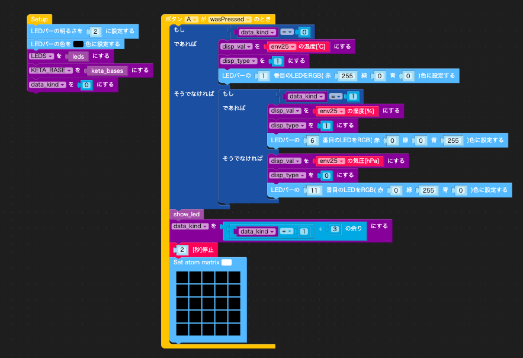

# atom matrix の数値をそろばん形式表示

atom matrix には ５x５の LED がついています。   
この LED にそろばん形式で数桁の数字を表示させてみました。

[動画](https://www.youtube.com/watch?v=ppzmPAwoGZs)
[](https://www.youtube.com/watch?v=ppzmPAwoGZs)

<!-- vscode-markdown-toc -->
* 1. [そろばんでの数字表示](#)
* 2. [Env 2 で得た値を LED に表示](#Env2LED)
* 3. [LDE 表示処理をカスタムブロック化](#LDE)
	* 3.1. [init_led_utils](#init_led_utils)
	* 3.2. [show_led_float_1](#show_led_float_1)
	* 3.3. [show_led_int](#show_led_int)
* 4. [Env 2 で得た値を LED に表示(カスタムブロック利用版)](#Env2LED-1)

<!-- vscode-markdown-toc-config
	numbering=true
	autoSave=true
	/vscode-markdown-toc-config -->
<!-- /vscode-markdown-toc -->

##  1. <a name=''></a>そろばんでの数字表示

そろばんでは 1 桁の数字を 5 つの珠で表示します。
[http://xn--d9jvb4cyam1by940f.com/post-58/](http://xn--d9jvb4cyam1by940f.com/post-58/) より
 

これを真似して、5 x 5 の LED で 5 桁の数字を表せます。

   

種数点に一列を使えば、小数も表示できます。


##  2. <a name='Env2LED'></a>Env 2 で得た値を LED に表示

uiflow で Env 2 で得た気温、湿度、気圧を LED 表示させてみます。  
気温と湿度は 小数点 1 位までの小数で表示します。  
気圧は整数で表示することにします。  
(今は マイナスの温度のことは考えないことにします...)

Aボタン (画面) を押すと気温、湿度、気圧の順で巡回するようにします。2秒表示すると画面をクリアします。




```python
from m5stack import *
from m5ui import *
from uiflow import *
import time
import unit

rgb.set_screen([0,0,0,0,0,0,0,0,0,0,0,0,0,0,0,0,0,0,0,0,0,0,0,0,0])
env25 = unit.get(unit.ENV2, unit.PORTA)


digit = None
led_base = None
disp_val = None
n = None
base10 = None
base = None
pos = None
data_kind = None
disp_type = None
LEDS = None
dsip_keta = None
KETA_BASE = None
delta = None

def upRange(start, stop, step):
  while start <= stop:
    yield start
    start += abs(step)

def downRange(start, stop, step):
  while start >= stop:
    yield start
    start -= abs(step)

def show_led():
  global digit, led_base, disp_val, n, base10, base, pos, data_kind, disp_type, LEDS, dsip_keta, KETA_BASE, delta
  if disp_type == 1:
    n = int((disp_val * 10))
    dsip_keta = 4
    rgb.setColor(24, 0x00ff00)
  else:
    n = int(disp_val)
    dsip_keta = 5
  base10 = 1
  for pos in (1 <= float(dsip_keta)) and upRange(1, float(dsip_keta), 1) or downRange(1, float(dsip_keta), 1):
    led_base = (KETA_BASE[disp_type])[base10]
    digit = n % 10
    for delta in (LEDS[digit]):
      rgb.setColor(led_base - 5 * int(delta), 0xff0000)
    n = int((n / 10))
    base10 = base10 * 10

def keta_bases():
  global digit, led_base, disp_val, n, base10, base, pos, data_kind, disp_type, LEDS, dsip_keta, KETA_BASE, delta
  return {0:({1:25,10:24,100:23,1000:22,10000:21}),1:({1:25,10:23,100:22,1000:21})}

def leds():
  global digit, led_base, disp_val, n, base10, base, pos, data_kind, disp_type, LEDS, dsip_keta, KETA_BASE, delta
  return {0:[],1:'0'.split(','),2:'0,1'.split(','),3:'0,1,2'.split(','),4:'0,1,2,3'.split(','),5:'4'.split(','),6:'4,0'.split(','),7:'4,0,1'.split(','),8:'4,0,1,2'.split(','),9:'4,0,1,2,3'.split(',')}


def buttonA_wasPressed():
  global digit, led_base, disp_val, n, base10, base, pos, data_kind, disp_type, LEDS, dsip_keta, KETA_BASE, delta
  if data_kind == 0:
    disp_val = env25.temperature
    disp_type = 1
    rgb.setColor(1, 0xff0000)
  else:
    if data_kind == 1:
      disp_val = env25.humidity
      disp_type = 1
      rgb.setColor(6, 0x0000ff)
    else:
      disp_val = env25.pressure
      disp_type = 0
      rgb.setColor(11, 0x00ff00)
  show_led()
  data_kind = (data_kind + 1) % 3
  wait(2)
  rgb.set_screen([0,0,0,0,0,0,0,0,0,0,0,0,0,0,0,0,0,0,0,0,0,0,0,0,0])
  pass
btnA.wasPressed(buttonA_wasPressed)


rgb.setBrightness(2)
rgb.setColorAll(0x000000)
LEDS = leds()
KETA_BASE = keta_bases()
data_kind = 0
```

##  3. <a name='LDE'></a>LDE 表示処理をカスタムブロック化

数字を 5 x 5 で表示されるのは、他のプログラムでも再利用できそうです。  
カスタムブロックにしてみました。

名前： LED_UTLES
ブロック
- 1. init_led_utils
- 2. show_led_float_1
- 3. show_led_int


###  3.1. <a name='init_led_utils'></a>init_led_utils


```python
g_led_utils_LEDS = {
  0:[],1:[0],2:[0,1],3:[0,1,2],4:[0,1,2,3],
  5:[4],6:[4,0],7:[4,0,1],8:[4,0,1,2],9:[4,0,1,2,3]
}
g_led_utils_KETA_BASES = {
  0:{1:25,10:24,100:23,1000:22,10000:21},
  1:{1:25,10:23,100:22,1000:21}
}
def g_show_led_val(val, show_type, show_keta):
  n = int(val)
  base10 = 1
  for pos in range(show_keta):
    digit = n % 10
    for delta in g_led_utils_LEDS[digit]:
      idx = g_led_utils_KETA_BASES[show_type][base10] - 5 * delta
      rgb.setColor(idx, 0xff0000)
    n = int(n / 10)
    base10 = base10 * 10
  if show_type == 1:
    rgb.setColor(24, 0x00ff00)

```

###  3.2. <a name='show_led_float_1'></a>show_led_float_1


```python
g_show_led_val(${show_led_float_1} * 10, 1, 4)
```

###  3.3. <a name='show_led_int'></a>show_led_int


```python
g_show_led_val(${show_led_int}, 0, 5)
```


##  4. <a name='Env2LED-1'></a>Env 2 で得た値を LED に表示(カスタムブロック利用版)

LED_UTILS のブロックをつかってプログラムを書き直しました。  
動作は書き換え前と同じです。


```python
from m5stack import *
from m5ui import *
from uiflow import *
import time
import unit

rgb.set_screen([0,0,0,0,0,0,0,0,0,0,0,0,0xFFFFFF,0,0,0,0xFFFFFF,0xFFFFFF,0,0,0xFFFFFF,0xFFFFFF,0xFFFFFF,0x0af55c,0xFFFFFF])
env25 = unit.get(unit.ENV2, unit.PORTA)


data_kind = None


def buttonA_wasPressed():
  global data_kind
  if data_kind == 0:
    rgb.setColor(1, 0xff0000)
    g_show_led_val(env25.temperature * 10, 1, 4)

  else:
    if data_kind == 1:
      rgb.setColor(6, 0x0000ff)
      g_show_led_val(env25.humidity * 10, 1, 4)

    else:
      rgb.setColor(11, 0x00ff00)
      g_show_led_val(env25.pressure, 0, 5)

  data_kind = (data_kind + 1) % 3
  wait(2)
  rgb.set_screen([0,0,0,0,0,0,0,0,0,0,0,0,0,0,0,0,0,0,0,0,0,0,0,0,0])
  pass
btnA.wasPressed(buttonA_wasPressed)


g_led_utils_LEDS = {
  0:[],1:[0],2:[0,1],3:[0,1,2],4:[0,1,2,3],
  5:[4],6:[4,0],7:[4,0,1],8:[4,0,1,2],9:[4,0,1,2,3]
}
g_led_utils_KETA_BASES = {
  0:{1:25,10:24,100:23,1000:22,10000:21},
  1:{1:25,10:23,100:22,1000:21}
}
def g_show_led_val(val, show_type, show_keta):
  n = int(val)
  base10 = 1
  for pos in range(show_keta):
    digit = n % 10
    for delta in g_led_utils_LEDS[digit]:
      idx = g_led_utils_KETA_BASES[show_type][base10] - 5 * delta
      rgb.setColor(idx, 0xff0000)
    n = int(n / 10)
    base10 = base10 * 10
  if show_type == 1:
    rgb.setColor(24, 0x00ff00)

rgb.setBrightness(2)
rgb.setColorAll(0x000000)
data_kind = 0
```
